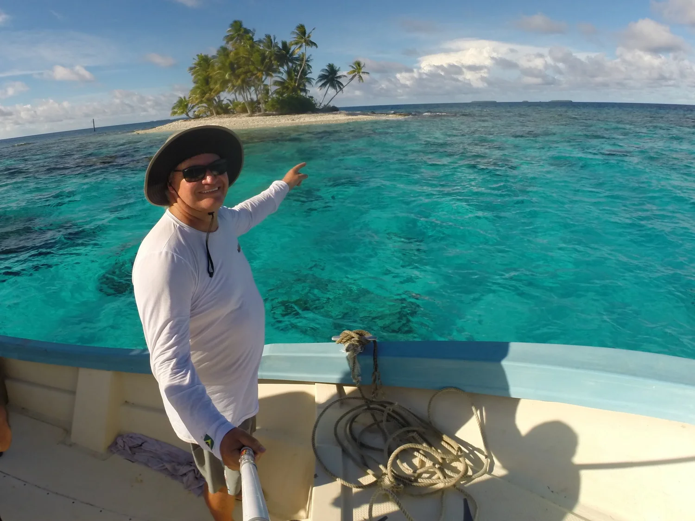
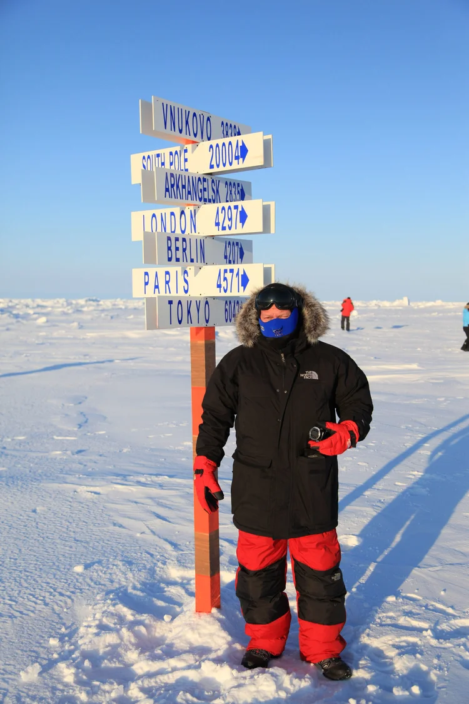
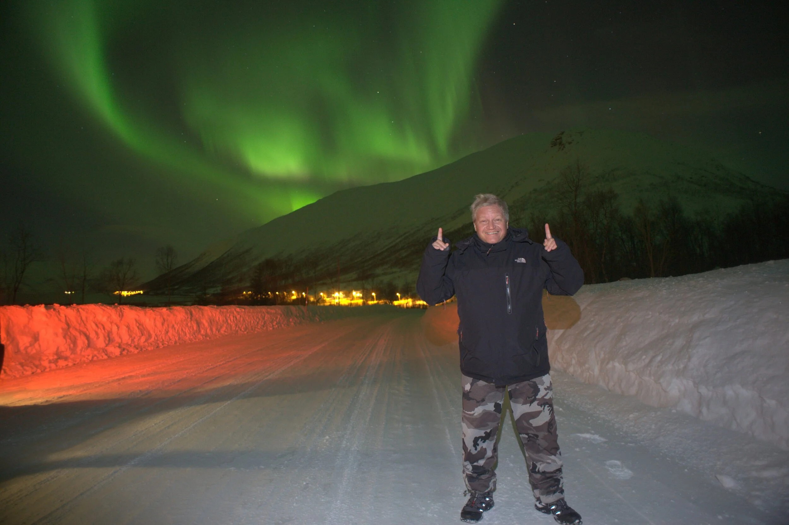


Meu nome é Claudio de Moraes. 
Jornalista, produtor, pai e aventureiro.



  
  
  
  
  
  
  
  
  
  
  


**Passei 40 anos viajando** a trabalho e férias ao redor do mundo. Fui responsável durante 5 anos (2010 a 2015) pela **produção do Planeta Extremo, programa da Globo**. 

Conheci lugares como o Pólo Sul, Pólo Norte, Deserto do Saara, Vietnã, China, Bahamas, África—muitos destinos! 

Essa experiência foi o meu mestrado em **responsabilidade e segurança com a vida alheia**. 

Hoje, com a Camaloa, busco unir toda essa experiência para organizar a **sua viagem dos sonhos com um roteiro personalizado**.


Quero viajar!


