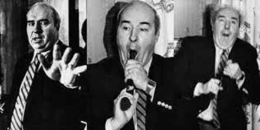
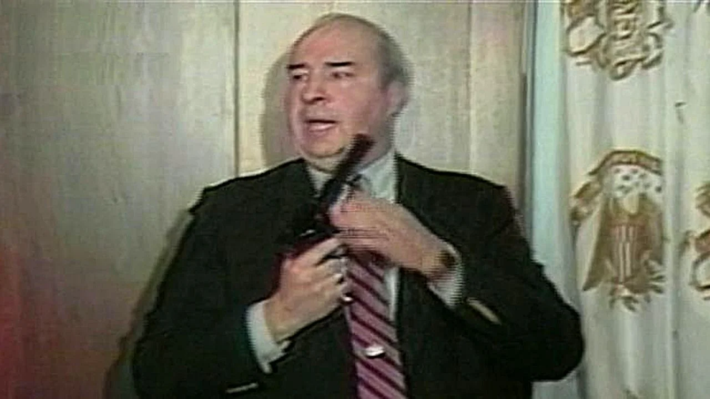

Janeiro de 1987 foi marcante na minha carreira. Já estava há 3 anos na Tv Globo como editor de imagens, e nesse momento da minha vida profissional estava entusiasmado com o rumo que seguia. Eu era o editor de imagens e finalizador na área internacional do Jornal Nacional junto com a jornalista Cristina Pinheiro quando essa bomba caiu no meu colo. Tínhamos um deadline(linha da morte), para finalizar as edições para que a operação de exibição do JN não corresse nenhum risco. Se a matéria não estivesse pronta até o deadline, a matéria não seria exibido. Nessa época todas as edições eram feitas num vídeo cassete U-matic. Não tinha a velocidade das plataformas de edição de hoje. E era seguido a risca pelos coordenadores.

A cena era chocante e aterrorizante. Vi inúmeras vezes a imagem que nos chegou pela agência REUTERS, do político norte-americano Budd Dwyer, cometendo suicídio com um tiro na boca durante a entrevista coletiva convocada por ele um dia antes do fato. Fiquei imaginando porque um cara com filhos e netos deixaria esse legado negativo para a família e porque não para humanidade? Nunca esqueci dos momentos que antecederam a exibição da matéria. Na ilha de edição (IPPJ\_Ilha de Pós-produção do Jornalismo), estavam eu, Armando Nogueira e Alberico Souza Cruz, que viria a ser diretor do jornalismo anos depois. Faltavam justamente 5 min para o deadline. Eram 19:35, e o JN começava às 20h em ponto. A pressão dentro da ilha era gigante! Cada um deles modificava a todo instante o momento final do vt:"... Frisa! Não! Frisa a imagem! Deixa o tiro! Hummmm, não ficou bom. Tira o som do tiro! Não! Frisa com a arma na boca! Não, frisa a imagem antes da arma ir em direção da boca!" E naquela época a edição era feita em fitas cassetes. Sabia perfeitamente o tempo que precisava ejetar a fita e sair correndo pelos corredores em direção ao controle, para exibição. O tempo passava e o deadline, já era! Mas também eu estava com os donos do brinquedo ali naquela ilha gélida. Era a única matéria que faltava entregar ao coordenador. E o frio na barriga aumentava pois a responsabilidade era grande! O editor de imagens é o responsável pelo produto final. Todo esforço de uma equipe termina no editor de imagens. E pra piorar a situação, a matéria, se não me falhe a memória, era a abertura do JN. Faltando 5 min para o jornal entrar no ar não pude evitar. Virei-me aflito e com frio na barriga na direção dos gigantes poderosos que estavam perto de mim e disse: "Amigos me perdoem mas se não decidirmos agora o vt não entra. Sugiro de frisarmos a imagem com a arma na boca antes do tiro e deixar o som do tiro! Foi quando finalmente decidiram por frisar a imagem, deixar o som do tiro e na sequência fiz um fade out. Faltavam 2 minutos para o início do JN. Tirei a fita sai correndo pelos corredores. Entreguei e rezei para que tudo desse certo na exibição. Eu tremia dos pés a cabeça e até calafrios eu senti depois que tudo passou. Foi um momento muito tenso. Na época, o Jornal da Manchete era o grande concorrente do JN. A Manchete mostrou na íntegra o momento do tiro e o sujeito caindo. O JN não! E foi uma decisão acertada! Qual a necessidade de mostrar as famílias brasileiras uma imagem chocante? Qual a necessidade de uma criança assistir um momento covarde do ser humano? Qual é o limite? A Globo foi muito criticada na época por ter frisado a imagem antes do tiro. Mas gente! A "internet" da época era a TV GLOBO! A síntese dos acontecimentos mundiais a gente via no JN. A internet de hoje não tem censura alguma. Hoje, não teria dúvida nenhuma. Faria o mesmo. Daria a mesma sugestão. Frisaria a imagem antes do tiro. A internet hoje é aberta e vemos mentiras, agressões e as titudes mais covardes do ser humano sem que haja um filtro. Não é sensura, mas é preciso principalmente preparar o cidadão com uma regulamentação adequada a nossa sociedade. A Globo continua, A Manchete não!

Com isso quero mostrar a importância do editor de imagens num momento crucial da edição. Passei 25 minutos da minha vida, tenso, calado, fazendo e refazendo uma finalização importante com os diretores do jornalismo ao meu lado! E nos minutos finais, num rompante pelo nervosismo, os diretores decidiram acatar minha sugestão. Ufa! Foi emocionante e angustiante passar por tudo aquilo! Mas acho que colaborei com os futuros cidadãos de uma maneira positiva. A edição de imagens não é somente a arte final", é um condutor de decisões para o bem ou para o mal. Valorize seu editor de imagens em qualquer área das mídias digitais.

