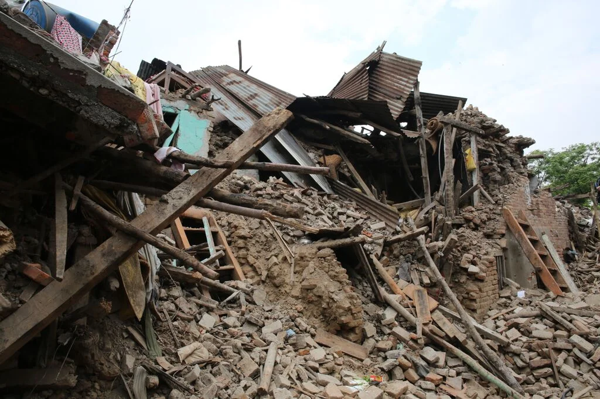
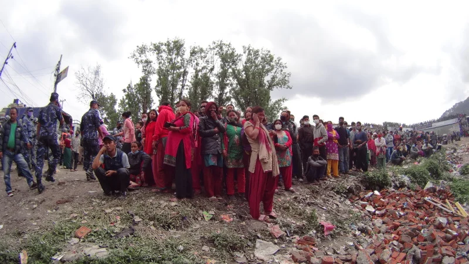
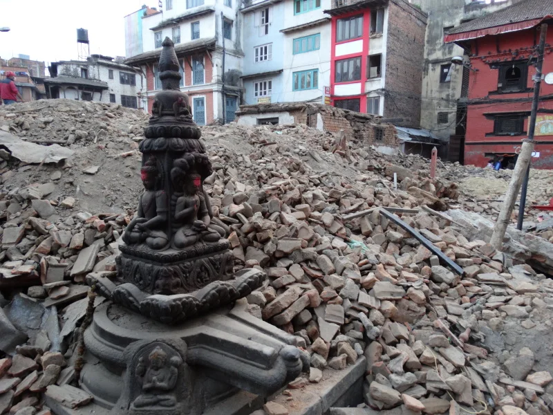

Chegamos em Katmandu e o cenário era de guerra. Me transportei para as cenas de filmes catástrofe de Hollywood! Nunca imaginei em toda a minha vida ver com os próprios olhos milhares de pessoas se movimentando pelas ruas sem rumo, sem direção, sem teto, sem casa, sem comida, sem tudo! Uma cena de doer qualquer coração ver famílias inteiras vagando, deitadas em plena rua, sem qualquer esperança.

Por onde passávamos era possível sentir o cheiro da morte. Pessoas chorando pela perda dos entes queridos e crianças com o olhar distante. Fomos a um hospital da cidade e nos deparamos com uma realidade cruel. Imaginei que uma guerra seria assim. Várias tendas com pessoas sendo atendidas pela CRUZ VERMELHA e outras entidades no pátio do prédio, que resistiu ao terremoto, mas tinha sérias rachaduras na estrutura. Nenhum dos feridos que chegavam no hospital, conscientes, não queriam ser tratadas no interior do hospital com medo de novos tremores, e foram muitas réplicas. Durante o dia e a noite, por pelo menos 3 dias, podíamos sentir o chão dar uns “tremiliques". O cheiro de plasma misturado com o sangue dava o tom da desgraça no ar empoeirado que respirávamos.

E quando achamos que a situação estava voltando a calma veio o segundo tremor forte, não tanto quanto ao primeiro mas o suficiente para nos deixar amedrontados. Estávamos vivenciando uma situação de catástrofe, e o medo, era a sensação natural diante do improvável e incontrolável. O ser humano não tem o domínio da situação num tremor, seja lá aonde for. Esse sentimento que estávamos todos envolvidos ficou estampado na reação da repórter Carol Barcellos quando estava entrevistando alguns brasileiros na embaixada do Brasil no Nepal. Gente, é assustador um terremoto! Parece que nunca vai parar de tremer! Não dá pra pensar em nada quando acontece. O medo da morte domina nossos pensamentos. As pessoas só querem abrigo e proteção e a reação era natural por tudo que estávamos passando. Carol foi muito criticada pela reação que teve mas queria muito que os críticos passassem pelo que vivenciamos. É algo que não temos controle. Você só quer que acabe logo!



Ainda estávamos sem celular e cada uma das equipes seguiu direções diferentes dentro de Katmandu para coletar informações e conteúdo. A equipe do Clayton, na qual eu estava, se dirigiu ao Instituto Médico Legal do Nepal, e presenciei um dos momentos mais tristes da minha vida. Cena que já tinha visto em filmes e nunca imaginei de presenciar. Eram tantas pessoas mortas pelo terremoto que fora do necrotério tinham pilhas de corpos entulhados uns em cima dos outros aguardando reconhecimento dos familiares. Muito triste tudo aquilo! Jamais vou conseguir apagar essas imagens da minha mente. Três dias depois que tudo começou fui entrevistado, ao vivo, pelo jornalista Milton Jung para a CBN, ao vivo, e ele me perguntou o que eu tinha visto de mais forte nessa catástrofe. Eu respondi que foi a pilha de corpos que me lembrou bem as imagens dos filmes gravados por nazistas durante o Holocausto, na Segunda Guerra Mundial.


  
  
  
  
  
  
  
  
  


Depois desse primeiro dia fomos para um pequeno hotel no centro de Katmandu e a ordem era:"…aconselhamos aos hóspedes a não dormirem nos quartos por causa de um possível terremoto de madrugada ou durante o dia, o que nos pegaria de surpresa, e não há o que fazer! Não dá tempo de fugir. Você simplesmente é soterrado se isso acontecer.” Fui o único momento da minha vida como produtor, que vi uma reserva de hotel obrigando o hóspede a dormir no lobby ou em volta da piscina. A opção dormir ou não dormir no quarto seria responsabilidade de cada um. Era a informação que faltava depois de 24h de caos total. Poucos de nós teve a coragem de dormir no quarto. Eu e o Clayton nos arriscamos e dormimos algumas horas. E o banho? Bem, isso era um luxo nessas circunstâncias e sinceramente não me lembro bem quantas horas depois do terremoto eu tomei o primeiro banho. Mas destaco aqui alguns momentos muito engraçados. O lobby do hotel estava lotado de gringos e depois de algumas horas desce um sujeito de pijama e só de cueca. Quem era? Sim! Ele! O Anão! O nosso repórter Clayton Conservani. Acho que foi a primeira vez que todos rimos juntos com alguns turistas. Foi uma cena lamentável e muito hilária! Outro fato marcante nessa maratona foi a compra de águas e biscoitos, pois essa foi a primeira ação diante da tragédia. Garantir água e comida para equipe. Afinal, “…temos que alimentar os convidados e a nossa equipe!”. Saiu Lucas e Carneiro para essa missão e sabem qual foi o produto que o Lucas quis garantir no meio de toda essa confusão? Uma caixa de todynho! ahahahahahah! Ele ama todynho! Deveria ser garoto propaganda. Em todas as nossas expedições ele sempre garantiu o todynho. Não é impressionante esse menino? Mas a realidade era outra. Todos, sem exceção, em algum momento, dormiu no lobby do hotel. Me lembro muito bem de ver ratos passeando entre as pessoas que estavam dormindo durante a madrugada. Essa imagem não esqueço. E não eram camundongos! Eram ratos grandes! E eles estavam a solta depois do terremoto. Katmandu não tem saneamento básico. Então dá pra imaginar a quantidade de ratos que se espalhou pela cidade. Lembro muito bem de estar conversando a noite, com o parceiro Claudio Carneiro, a beira da piscina, e sentir novo tremor. Pequeno mais o suficiente para eu sair correndo pois estávamos próximo a um muro de contenção. Não aconteceu nada mas rimos nervosos diante de mais um réplica. E foram muitas! Perdi a conta de quantos tremores sentíamos diariamente sob nossos pés. Qualquer tremor é aterrorizante depois do primeiro. Como diz o ditado:”A primeira vez a gente nunca esquece!

A essa hora já tínhamos feito contato com o Brasil. A missão agora era entrar ao vivo, em rede nacional. Só a nossa equipe estava em katmandu. Foi quando o nosso guia Arpan Sherman e o Igor conseguiram apoio da TV estatal. Mas e a luz? Como vamos gerar conteúdo para o Brasil sem eletricidade? O país inteiro estava sem energia elétrica. E porque não geradores? Nem pensar! Até que tentamos, mas todos que existiam estavam sendo utilizados no apoio e na logística dos desabrigados em hospitais e acampamentos de refugiados. Depois de algumas horas é que conseguimos com a Tv estatal do Nepal uma Unidade Móvel(UM), e um gerador, mas eles já não eram utilizados há 7 anos! Estavam todos cobertos de ferrugem, e pior, com a fiação aparente. Tínhamos que colocar ao vivo as nossas informações. O mundo já via com força total todas as imagens sobre a catástrofe. As imagens da Carol assustada com o tremor já estavam circulando o planeta! A essa altura já conseguíamos falar com os familiares no Brasil e deixa-los mais tranquilos em relação ao que estávamos passando. Nos sentimos muito amados e isso foi muito bom nesse momento. A minha única reclamação e indignação, que não era apenas minha, é que a assistência social da Tv Globo sequer entrou em contato com nossos familiares. Fomos ignorados pelo setor mais importante durante essa tragédia. Lamentável e pífio essa atitude! Mas isso não tirou o brilho do nosso esforço para que pudéssemos conseguir com sucesso essa verdadeira empreitada sem a mínima condição de trabalho.

Conto na próxima semana como foi essa façanha. Fomos a primeira TV no Planeta e entrar com imagens ao vivo, do Nepal, em rede Nacional, no Jornal Nacional, em plena catástrofe humanitária e Mundial. Foi simplesmente histórico para o Telejornalismo e está na Memória Globo.