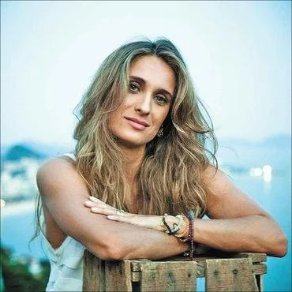
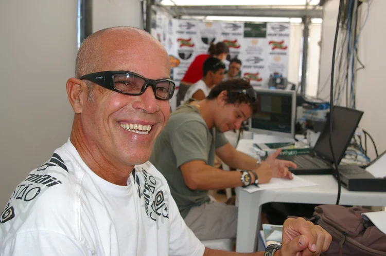
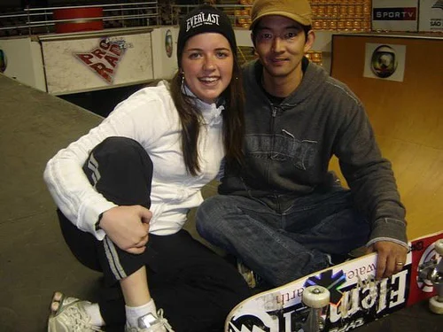
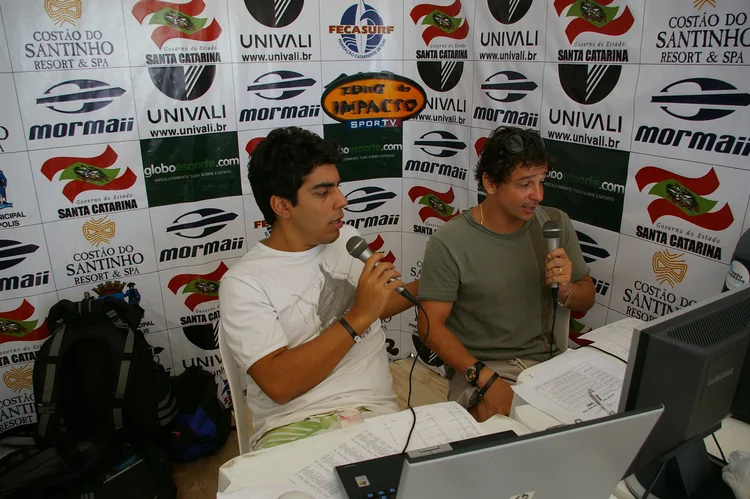
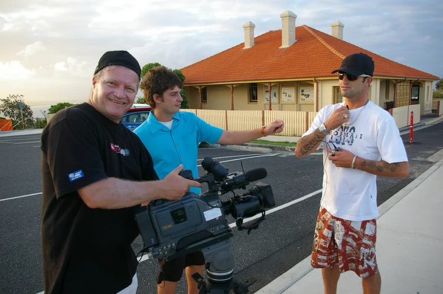

Tive um período na minha vida profissional que fui um dos homens mais afortunados do Brasil. Estive no comando das mulheres mais lindas da televisão brasileira. Lívia Lemos, Luise Altenhofen, Diana Bouth, Cintia Howlet, Dora Vergueiro, Luciana Furlan, ou seja, um time de ponta no quesito beleza. Um time  de mulheres famosas! O ano era 2004. Fui “promovido” a ser o “editor-chefe” do programa Zona de Impacto, do canal Sportv.  Nunca tive um salário digno de um editor-chefe, mas abracei essa nova oportunidade como todas que tive dentro da Tv Globo, nos meus 35 anos de trabalho naquela empresa, afinal não era formado, e também não me importava com isso já que não se fecha janelas. Temos que “abrir” todas as janelas. Era abril de 2004 e fui convocado pra participar da 1ª reunião de editores chefes do canal. Fui cumprimentado por todos. Tinham aproximadamente umas 9 cabeças, e a minha 1ª incumbência definida sem o meu conhecimento era DEMITIR TODAS ELAS! Me enfiaram garganta abaixo um calhamaço de avaliações, dessas meninas. Uma penca de papéis. E me pediram pra demitir todas!!! Acho que aprendi ali a definir o significado da palavra OPORTUNIDADE! E o que não me faltou na minha vida foram as OPORTUNIDADES.

**OPORTUNIDADE**. É um substantivo feminino oriundo do latim opportunitate mas também deriva do termo em latim opportunus que significa “favorável, adequado, desejável, chance, ocasião, ensejo, lance, brecha.

**Vamos por partes.** 

A minha oportunidade não veio sem bons antecedentes. Uma empresa privada como a TV Globo é preciso ter talento e expertise durante a jornada profissional. Logicamente que existem os “QIs”, o famoso “quem indicou”, mas sempre vi um número pequeno de “paraquedistas”. Nessa época estava colaborando com a Tv Globo no desenvolvimento do “kit correspondente”. Um equipamento que tinha 1 câmera, 1 microfone e um lap top com o software Adobe Premier Pro instalado para que o conteúdo fosse gravado, editado, finalizado e gerado através de qualquer sinal de internet. Foram alguns anos trabalhando com esse equipamento, de 96 a 2003, realizando muitos trabalhos com esse equipamento em várias partes do Brasil e do Mundo. Nessa época não era fácil. A internet não tinha a velocidade que tem hoje e tudo era gerado por FTPS, uma carroça. Mas gerava conteúdo por um custo baixíssimo diante das up links, via satélite. Pra se ter uma ideia da diferença de custos um up link numa transmissão de 1 hora se gastava, apenas como exemplo, R$ 10.000,00, dez mil reais, utilizando o kit o custo de transmissão era R$ 1.000,00, mil reais. Hoje em dia todas transmissões ao vivo de repórteres são feitos via internet. Eu tinha a experiência de editar imagens, escrever relativamente o necessário e tinha conhecimento do equipamento pra realizar o que a TV queria. Ter conhecimento em tecnologia nessa época era, e ainda é fundamental, e eu estava na ponta do conhecimento. Já tinha participado de 3 Copas do Mundo, 3 Olimpíadas e vários outros eventos pelo departamento de Esporte, e quando estava trabalhando como produtor de reportagens para o Esporte Espetacular, tive a minha OPORTUNIDADE aproveitada quando fui chamado para ser editor-chefe em 2004 do programa ZONA DE IMPACTO, pelo então diretor do canal Emanuel Castro. Nessa época tinha pleno domínio de todas as fases pra se levar conteúdo pro ar mas não sabia e nem tinha conhecimento em administrar “SERES HUMANOS”! A minha ida para um programa de esportes de ação foi por um motivo simples. Eu amo o surf e tinha uma ligação muito forte com os eventos mundiais de esportes de ação, e através de um amigo,  que já não está mais entre nós, MANO ZIUL, que ajudou muito na minha evolução profissional, fui promovido para essa nova função. Minha carreira deslanchou e cheguei no canal Sportv. Devo muito ao Mano Ziul mas ele será um outro capítulo que vou escrever em breve. 

Na 1ª reunião de chefias, a minha primeira missão. Me ofereceram na bandeja a cabeça das meninas. Sim, demitir todas as apresentadoras. Me deram sinal verde para essa atitude. E pra minha surpresa uma mulher, a única nessa reunião, era a personagem que invocava com mais veemência a demissão de todas elas. Fiquei atônito com aquele clima hostil na minha primeira reunião com os chefes do canal. Vi que não seria fácil a minha missão. A minha 1ª reação foi instintiva. Depois desse pedido inusitado de quase todos os chefes que estavam nessa reunião minha resposta foi:”Gente, temos que dar **OPORTUNIDADE** a essas meninas de se adaptarem a uma nova realidade!”. Explico melhor. Em 2003 a Tv Globo assumiu o conteúdo de alguns canais GLOBOSAT. Eram empresas do mesmo dono mas administrações separadas, independentes. E o canal Sportv era um desses canais. Todas essas meninas tinham o guarda chuva da GLOBOSAT, e de repente passaram a ter o conteúdo radicalmente modificado por outro conceito, o jornalismo como forma de entretenimento. Agora estavam sob o comando da TV Globo. E o programa Zona de Impacto pertencia ao canal Sportv, da GLOBOSAT. Foi um choque violento para as meninas essa mudança. Quando cheguei ouvia muitas brincadeiras de mau gosto como o programa do **“PEIXE BUNDINHA”.** Ouvia nos corredores piadinhas de mau gosto de alguns jornalistas como **“CLAUDINHO, O DONO DAS MULHERES MAIS GOSTOSAS DO BRASIL”**. Gracinhas de péssimo gosto. Muitas delas já tinham sido fotografadas pela revista Playboy e essa identidade não estava nos planos do “novo jornalismo” que se apresentava naquele momento. Pra elas foi como mudar da água para o vinho. E era muito injusto não dar pelo menos uma **OPORTUNIDADE** pra possibilidade de adaptação. E injustiça não era e não é a minha praia! E sempre as tratei com muito respeito. Estar no comando de um programa não ter domínio sobre as pessoas. E preciso RESPEITO, principalmente. E posso dizer com toda a firmeza que nunca me aproveitei do cargo que assumi para adquirir "vantagens”sobre qualquer pessoa sob meu domínio. Tratei todos com muito profissionalismo.


  
  
  
  
  
  


Na minha 1ª reunião com todas elas me senti estranho. Uma sensação esquisita de estar ali no comando daquelas meninas que eram imponentes pela beleza mas que estavam numa situação muito vulnerável. Fui bem transparente e expliquei tudo que estava acontecendo. Expliquei para todas elas como seria esse novo conceito que o programa passaria a ter. Disse com todas as letras, que todas teriam a **OPORTUNIDADE** de se adaptarem a esse novo horizonte, e que teriam um prazo razoável pra aquela nova realidade que se apresentava. De cara, já anunciei que a Diana Bouth seria a apresentadora titular e que dificilmente a tiraria do estúdio, a não ser por algum problema de doença ou qualquer outro motivo. Era preciso criar uma identidade para o programa. Já havia trabalho em alguns eventos dos XGAMES com a Diana, nas transmissões do Esporte Espetacular, e me encantei com o trabalho dela. Senti que todas as outras ficaram um pouco chateadas com aquela decisão. Todas apresentavam quadros dentro do programa e queria mudar esse modelo de apresentação. A conversa foi franca e objetiva e todas saíram com a missão de tentar se adaptar aos novos conceitos de trabalho. Todas deveriam agir e reportar de outra maneira diante das câmeras. A METAMORFOSE para essa nova etapa foi natural. Algumas não conseguiram e não queriam se adaptar aquele formato. Mas a vida continua e a roda gira, pra todos nesse Mundo. Algumas foram sendo substituídas por estagiárias e estagiários ao longo dos anos.

Foi um início difícil pra mim também. Me adaptar num terreno aonde ainda não tinha o domínio. Não parava de acumular funções. Acompanhei o circuito mundial de surfe durante 6 anos da minha vida. Fui a quase todas as competições, e sabia que seria difícil conciliar o trabalho de editor chefe com as competições in loco das etapas do mundial. Na minha primeira aparição dentro do switcher(área de exibição do programa), fui surpreendido, com um grito mal educado, de um coordenador numa transmissão ao vivo de algum evento que não me lembro. O grito foi tão alto que o diretor de TV ficou mudo, sem reação! Estava na hora de agir como editor-chefe. Chamei o coordenador num canto e disse calmamente! “A próxima vez que você gritar dentro da área de exibição do programa você será demitido!” Nunca, durante o tempo de TV que tinha eu havia presenciado alguém gritar com um diretor de TV ou qualquer outro profissional por mais que o erro fosse grotesco. Foi instintivo e necessário. Tinha que me impor sobre aquela situação ridícula e tirei esse coordenador das transmissões temporariamente. Ele ficou totalmente atônito com a minha reação e vi que ficou desestabilizado. Num swichter é preciso ter calma, falar baixo, pois existe comunicação entre todos os envolvidos e principalmente RESPEITO. É um lugar aonde todos estão com os nervos a flor da pele mas é preciso ter postura profissional.

Eu tinha um tripé dentro do programa que eram pessoas que já estavam lá antes de mim e sabiam muito sobre o funcionamento do canal. A produtora Ana Hissa (hoje em no UFC, no canal COMBATE)), Flávio Winter ( hoje no Esporte Espetacular), e o Mário Filho (tem um canal no You Tube). Todos empenhados em acompanhar a evolução. E foi o que fiz. Compartilhei todo o meu conhecimento com eles, e com os repórteres dos programas, e que em alguns momentos também viajavam no meu lugar para as grandes coberturas ao vivo. Com 4 meses no canal um certo dia um deles chegou pra mim e disse:”Você precisa fazer a diferença. Pra se manter aqui no canal você precisa fazer história!” Fiquei surpreso com aquela frase repentina e sincera nos meus ouvidos, e a partir dali aquela frase não saiu do meu pensamento. Me lançaram um desafio, porra! E sou movido a desafios! E sai mudo, diante daquele papo reto, repentino. Sempre que viajava deixava a responsabilidade do programa na mão de um deles porque sabia que o programa não teria problemas. Até que em março de 2005, na Gold Coast, na praia de Snapper Rocks, Gold Coast, na Austrália, num evento da QuickSilver, fazendo vivos com o repórter Regis Rosing, me deu um estalo! Acendeu a lampadinha!

Pra quem trabalha com entretenimento sabe que existe uma palavra que tem uma importância enorme em televisão, **IDEIAS, CRIAR, INOVAR.** Fui até o Mano Ziul, e perguntei se era possível jogar o sinal de internet na TV para transmitir ao vivo do meu lap top do kit correspondente. Ele me disse que daria a resposta mais tarde. Que iria ver essa possibilidade. Só pra vocês terem uma ideia da dificuldade, nos nossos experimentos de vivos, quando o Régis entrava ao vivo no Brasil esse sinal chegava 1 minuto e meio depois, por conta do delay, um atraso, ou seja, um risco na operação que normalmente na maioria das vezes não dava certo. Ou o Regis entrava já falando ou ele entrava ainda sem iniciar a fala dentro da exibição do programa, uma loucura! Se fizéssemos uma transmissão ao vivo de algum evento o risco seria menor e teríamos apenas uma entrada e uma saída para o break, comercial, o que diminuiria o risco de errar. Encontrei-me com o Mano Ziul a noite e conversamos sobre essa possibilidade e ele disse que seria possível através do lap top do kit correspondente, BINGO! Na volta ao Brasil levei a ideia para 2 pessoas que foram fundamentais nessa nova opção de transmissão. Gilberto Conde e o nosso diretor Emanuel Castro. Eles amaram a ideia e o nosso 1º teste seria na próxima etapa, no Tahiti, em Teahupoo, a “PRAIA DOS CRÂNIOS QUEBRADOS”, nome criado pelo próprio Régis, dessas ondas fantásticas mas muito perigosas. A mais temida do circuito profissional. Nesse período eu e o Regis, depois em outras etapas foram outros repórteres. Tirar um repórter de rede da TV GLOBO para cobrir o surfe mundial na época era uma tarefa difícil. Mas a minha intenção era dar peso, força e credibilidade nas coberturas e levar ao público da TV aberta lugares paradisíacos e inusitados através do surfe. Popularizar um esporte que até então o povão não tinha acesso, e logicamente através do Zona de Impacto viria esse conhecimento. Levar um conteúdo profissional para o Brasil inteiro. Mostrar para os telespectadores os verdadeiros "BRAZILIAN STORMS", nomes como Peterson Rosa, Victor Ribas, Neco Padaratz, Renan Rocha e o Mineirinho, que estavam conquistando espaços de uma nova geração que estava por vir. Os tempos eram difíceis para o surfe e o Zona de Impacto sempre deu grande destaque para esses e outros guerreiros do surf nacional. E queríamos levar aos brasileiros esses caras que estavam entre os melhores do planeta. Queria tirar o surfe da zona de conforto e levar as periferias. Como disse o Emanuel Castro:**"PRECISAMOS FORJAR CAMPEÕES NOS ESPORTES DE AÇÃO COM O ZONA DE IMPACTO!”**. E ele não estava errado! Anos depois a Diana Bouth encontrou com tricampeão mundial Gabriel Medina e ele disse a ela:"Não perdia as transmissões do Zona de Impacto. Via todas as etapas do mundial!". Não há melhor reconhecimento que esse. Sim! O programa ajudou a forjar campeões!

Todo esporte precisa de referências! Campeões que atraem o público, seja pelo carisma ou pelas atitudes. O Régis tinha uma conexão com o Kelly impressionate! Régis não fala inglês, e também não precisava. Tanto que na conquista do sétimo título mundial, em Teahupoo, a primeira TV a ele dar entrevista, foi pra o Zona de Impacto! Régis não fez pergunta nenhuma. Apenas direcionou o microfone e ele falou por uns 3 minutos, ainda dentro dágua! Ele saiu da onda e veio direto no nosso barco dar entrevista. Foi épico! Essa transmissão foi histórica. Nunca vi o Kelly tão a vontade com um repórter como o Régis. Existia uma química incompreensível e logicamente eu achava ótimo para o programa. Quando os 2 se encontravam o sorriso era natural. Régis fala apenas:"kelly, the best!" E o Kelly sorria e falava pelos cotovelos! kkkkkkkkkkkk Era incrível ver aquela situação. Kelly era um pouco arredio ao jornalistas do tour mas com o Régis era diferente. Sempre foi!

As imagens dessa transmissão apareciam no Brasil “pixeladas”, como um mosaico, mas foi um sucesso! Afinal, estávamos transmitindo ao vivo uma etapa do mundial de surf, do Tahiti! O ibope dessa transmissão explodiu e a partir dali em todas etapas que o Zona de Impacto estivesse, haveria transmissão ao vivo, com repórter in locco ou com um âncora(apresentador), na emissora, na cabine do Brasil, com a Diana Bouth e convidados. Voltei pro Brasil e quando encontrei o companheiro que me desafiou falei:”Acho que fiz a diferença, não! “Entramos para a história do canal, e da Tv Globo. Fizemos a primeira transmissão ao vivo de um evento esportivo de surfe com sinal via internet”. Ele se calou e só me comprimento pelo feito, mas deixei bem claro que ali era um time, e que **“O MEU SUCESSO ERA O SUCESSO DE TODOS”**. Tive a minha OPORTUNIDADE de mostrar que era possível. A partir dali vivemos uns 2 anos de evolução profissional do programa e das pessoas que estavam na equipe, e o amadurecimento foi fundamental para o programa e para o canal. Depois dessa transmissão teve engenheiro da TV GLOBO me ligando querendo saber como fazíamos essas transmissões! Foi épico! Tive a certeza que compartilhar conhecimento é o sucesso, o caminho! Essa seria a chave pra humanizar nosso conteúdo. Dar **OPORTUNIDADE** para as pessoas crescerem seria fundamental num jardim de vaidades. Porque televisão é um mundo de vaidades. Muito difícil o ambiente. Muito competitivo! E trazer a união num ambiente desses seria o melhor tática. Todos aprenderam a trabalhar com o kit correspondente para justamente estarem atuando nos eventos ao vivo, via internet. O programa cresceu, amadureceu e foi possível mostrar que tudo seria possível a um baixíssimo custo operacional.

Nesse período de aprendizado e glória muitos estagiários passaram pelo programa. Quase todos queriam ter alguma experiência no Zona de Impacto, afinal éramos um programa de vanguarda. E a vanguarda atrai situações boas e ruins, e ao mesmo tempo incomoda. Certa vez, em outra reunião de chefias levei 2 questões importantes. A primeira, as redes sociais, e a segunda em relação a comunicação durante as transmissões. Falei da importância do YouTube, Facebook e do Twitter para o programa, pois os jovens estavam migrando rapidamente para essas redes e disse que seria maravilhoso usarmos essas ferramentas no Zona de Impacto, e no canal. Todos questionaram negativamente sobre o uso dessas ferramentas que iriam destruir o conteúdo da TV. Fui voto vencido. A maioria condenou minha ideia. Fui duramente criticado na reunião. E hoje podemos ver que eu não estava errado. Essa **IDEIA** que levei para uma reunião hoje é usada em larga escala nos meios de comunicação. Seja radio, tv, jornal, etc… as redes sociais estão compartilhando conteúdo massivamente numa escala fora de controle através dos smartphones e outras tecnologias. **“Se você não pode com o inimigo se alie a ele”.** Era muito difícil levar ideias que revolucionariam o futuro para uma galera que pensava apenas futebol, infelizmente.

A segunda ideia foi lançar o Skype como meio de coordenação para todos os eventos ao vivo. Seja num flash ou qualquer outra forma de comunicação na coordenação de vivos. Novamente fui voto vencido. Alegaram que poderia **“entrar algum tipo de vírus no sistema".** Total ignorância de quem desconhece sistemas compartilhados. Para vocês terem uma ideia em termos de valores a nossa coordenação por telefone tinha um custo de aproximadamente R$ 5.000,00, com o Skype esse custo seria de R$ 200,00! A transmissão via internet custava R$ 5.000,00. Por satélite esse custo saltava para R$ 50.000,00!!! Uma diferença absurda! Hoje em dia todos os vivos são coordenados através do Skype, ou seja, a vanguarda não só incomoda mas as novas ideias trazem "cegueira” nas pessoas que não conseguem acompanhar a evolução tecnológica que influenciariam no futuro as nossas produções. Era o ano de 2006! Eu ja via e sentia que estávamos perdendo terreno pois lá fora do Brasil os caras já estavam fazendo experiências incríveis com as redes sociais e via que estávamos ficando pra trás! Essas derrotas, depois de tanta inovação, foi fazendo eu perder o tesão. Passei a não frequentar mais as reuniões de chefias. Mandava sempre alguém no meu lugar e passei a me dedicar a "casinha". Dentro do canal era uma luta inglória colocar um produto no ar. O programa tinha apenas poucas horas de ilha de edição. O que era um absurdo pois tinha custo a utilização desse tempo. Quando entrei no programa o orçamento anual do Zona de Impacto era de aproximadamente R$ 4.000.000,00 de reais. Tinham produtos comprados que se pagavam quantias absurdas a produtoras que serviam ao programa com conteúdos duvidosos e de baixa qualidade. Ganhei muita antipatia por eliminar uma penca deles do orçamento do programa.

No segundo ano o orçamento do Programa caiu para menos de R$ 2.000.000,00 de reais e focamos nas transmissões ao vivo, principalmente em parcerias com a RED BULL, o WCT, hoje WSL e as marcas Billabong, Quicksilver e Rip Curl, que bancavam nossas despesas de produção para as transmissões, inclusive os sinais de transmissões via internet. O Zona de Impacto era um programa de iniciativas, acertando ou errando, arriscávamos sempre. Aprendi assim na TV GLOBO.


  
  
  
  
  
  
  
  


E fazendo um parênteses aqui, um dia, logo quando retornei da Olimpíada de Barcelona, em 92, e pedi ao meu chefe direto, Luís Fernando Lima, que viria a se tornar diretor de Esportes da Globo, solicitei um aumento salarial. Ele me respondeu:"Faça por merecer! Quer ganhar mais! Faça mais!” Agradeço a ele até hoje por essas palavras. Entendi o recado! Eu na época era um excelente editor de imagens. Não era formado em jornalismo. Até tentei por 2 vezes fazer faculdade mas as viagens eram muitas, já tinha filhos, e não tinha tempo, no momento pra me dedicar a uma faculdade. A partir daí comecei a escrever e a usar uma câmera aquática para tentar superar minhas deficiências. Quando você não é formado dentro de um ambiente profissional e competitivo é preciso fazer mais, para ser algo mais. E levei essa mentalidade para o Zona de Impacto pois ali eu já usava uma câmera, escrevia razoavelmente, editava imagens e estava aprendendo a ADMINISTRAR PESSOAS. E essa tarefa é umas das mais difíceis pois você passa a ser um "psicólogo". Você passa a ser um pára-raio para todos os problemas pessoais de cada ser humano que trabalha contigo. E tem 2 lados. Primeiro vamos ver do lado positivo quando você consegue dar OPORTUNIDADE para alguém.

Um certo dia, uma estagiária em especial me chamou a atenção. Carolina Barcellos, ou Carol Barcellos. Ela me parou inesperadamente no corredor e me disse:”Quero muito trabalhar no programa. Por favor me dê essa chance. Me dê essa **OPORTUNIDADE!”.** Fiquei meio zonzo. Meio tonto com aquele pedido. Me lembrei quando entrei para a TV GLOBO, em 1984. Me recordei da minha iniciativa de ir até a sala do meu chefe, Marcos Novaes, e pedir essa **OPORTUNIDADE**, o que fez fez toda a diferença para o resto da minha vida. E ao mesmo tempo a Diana estava grávida, e depois pensei na possibilidade de alguém substituir a Diana. Sei lá! Vai que um dia ela não possa apresentar e na equipe não tinha ninguém com a capacidade dela. A Diana dominava o estúdio. Ela dirigia o diretor de tv! Além de ter um felling pra apresentação fenomenal para o público que queríamos atingir mas eu precisava também de alguém com outra pegada. A linguagem jornalística! Enfim, dei a OPORTUNIDADE que a Carol desejava. Uma das meninas, se não me engano, a Cíntia Howlet, pediu demissão, e eu pedi para o Emanuel contratar ela pra equipe. E deu liga! Alguns meses depois de contratada disse a ela:”Se prepara que você vai substituir a Diana durante a licença maternidade. Ele arregalou os olhos e disse que não estava preparada para aquele momento. Eu respondi que ia dar tudo certo! Comece a se preparar! Fico orgulhoso de falar que essa repórter e apresentadora foi forjada no Zona de Impacto, e que nos dias de hoje tem um carisma que conquistou o público através do trabalho, muito trabalho. Um dia depois de um encontro anual de produtores e editores de chefes, em Angra dos Reis, um dos diretores do esporte da Globo me perguntou se eu toparia trocar um funcionário por ela. E esse funcionário estava dando problemas lá na Globo. Aliás esse sujeito quase me demitiu em 1988, quando editava imagens para o Globo Repórter! Vocês vejam como o mundo dá voltas! Eu respondi a essa proposta indecente da seguinte maneira:”Eu te dou a solução e você quer me dar um problema? Lógico que não!”Ele riu pra mim e saiu manso. Três meses depois a Carol foi transferida para a TV Globo como repórter do esporte. Isso em 2008. Não tive força pra segura-lá no programa mas estava feliz por ela. Precisamos de outros caminhos. Novas **OPORTUNIDADES!** Não veio ninguém para o lugar dela.

Mas a OPORTUNIDADE mais cristalina e mais difícil, pela resistência de outras pessoas do canal, dei a outra mulher. Uma produtora extremamente competente que ninguém a enxergava como uma repórter e apresentadora de peso, a ANA HISSA. Um dia cheguei pra ela e falei:” Quero você na reportagem! Comece a produzir reportagens para o programa com você no vídeo. Não quero mais você na redação como produtora. Ela se assustou e disse que seria difícil pra ela. Eu falei que não! Ela teria essa **OPORTUNIDADE**. Eu sempre achei a Ana muita apta para qualquer tarefa dentro da televisão. Mas ninguém via nela uma repórter ou apresentadora. Talvez pelo jeito que ela se vestia, aquele óculos de fundo de garrafa, aquela voz forte e potente e um carisma pra falar na frente da lente. É difícil você falar para uma lente! Mas eu apostei e tive a sagacidade de mostrar pra ela que era possível. Tenho orgulho de dizer que eu coloquei ela pela 1ª vez numa reportagem, no vídeo. Fui muito criticado no canal por isso. Muitos “amigos”, diziam que ela era feia e que não tinha nenhum carisma para o vídeo. Pois bem, hoje ela está brilhando no UFC, no canal COMBATE. É uma das mais competentes apresentadoras e comentarista do Sportv. Ela poderia ser mais se quisesse mas sejamos felizes com o que somos. Eu particularmente, sempre vi uma beleza misteriosa! Sempre achei.  A falta de visão quase tira uma **OPORTUNIDADE** de ouro para uma profissional de um talento enorme!


  
  
  
  


Só tenho boas lembranças dessa época no Sportv. Não tínhamos a riqueza de equipamentos que tinha a TV Globo, mas tínhamos a **OUSADIA** pra criar e ter ideias com muito pouco. Tínhamos apenas um estúdio que servia a todos os programas do canal. A engenharia fazia esforços impressionantes, através de amigos que acreditavam em nossas ideias para colocar o programa no ar para atender nossa demanda. Fizemos transmissões épicas como o RED BULL AIR RACE, na praia de Botafogo. Transmissões em locais exóticos como o campeonato de skate no mar, num forte na Bahia, no meio do Oceano. Um evento numa praça de touros de motocross, em Madri. Kelly Slater campeão mundial em Floripa, enfim, uma época de muito aprendizado em que a palavra **COMPARTILHAR** e dar **OPORTUNIDADES** era o norte. Em 2009, mudou a direção do canal. Saiu o Emanuel Castro e entrou Raul Costa Junior, e não tinha mais clima para continuar. Alguns produtores do programa como Igor Tavares e Irene Vasconcellos, que aprenderam muito com o Zona de Impacto, e eram extremamente competentes, tanto que eu estava preparando eles para reportar e apresentar, foram remanejados para outras áreas e não veio ninguém para o lugar deles. Aos poucos foram “aleijando” o programa. Certo dia, cheguei no canal e demitiram o DJ MB, Marcos Bocayuva, sem qualquer consulta prévia! Uma pessoa de um coração enorme e com um entendimento do surfe profissional absurdo para as nossas transmissões, tanto que hoje em dia ele é um dos comentaristas do WSL mundial! MB foi a era musical do Zona de Impacto, ideia do Emanuel que queria música no programa, e levamos gente de peso para o estúdio. Transformamos as sextas-feira como a identidade musical do programa. Emicida, Chorão, Dado Villa-Lobos, Donovan Frankenheimer, enfim, nada é eterno! Tudo muda e tudo se transforma.

Eu a Diana choramos juntos com o que estava acontecendo. Era a maior falta de respeito que já tinha visto. Tudo acontecia e não era mais consultado. Não tive outra alternativa a não ser jogar a toalha. Pedi a transferência para a Tv Globo. As transmissões do mundial de surf via internet ainda continuam e outros esportes se aproveitaram dessas ferramentas poderosas e de baixo custo. Me sinto orgulhoso de ter feito parte dessa história linda! O marketing e a engenharia do canal foram os que mais torciam pelo sucesso do programa. Pedro Garcia e a equipe de marketing sempre jogaram positivamente para o sucesso do programa. Djalma Fuentes, da engenharia era durão mas amava as ideias mirabolantes do Zona. Uma vez queria colocar uma aeronave da Red Bull no estúdio do programa. Levei ele a loucura mas ele topou a ideia, o que acabou não acontecendo! Também apareci com a ideia de montar um half pipe (pista curve de skate), no estúdio. Ele esbravejou mas colocamos uma pista para o apresentador Tiago Brant, e deu certo! Deu tanto certo que o Tiago levou uma vaca ao vivo dentro do programa, foi hilariante! Graças a Deus ele não se machucou. Uma época de vanguarda aonde pude contar com a ajuda de amigos para desenvolver, **tecnologias e ideias**, que hoje estão ao alcance de todos. Em um ambiente de criação não conseguimos realizar nada sozinho. Sempre precisaremos de outras pessoas para que as ideias e projetos sejam realizados. **NÃO SE FAZ NADA SOZINHO EM TELEVISÃO!**

Quando pedi pra sair poderia ser demitido. O novo diretor do canal Raul Costa Júnior me tirou do programa mas numa conversa reservada me ofereceu a ida para a Copa do Mundo de 2010 na África do Sul com o kit correspondente, mas pedi pra retornar pra casa de onde eu sai, para o Esporte Espetacular, e fui recebido de braços abertos pelo Jornalista Sidney Garambone, editor-chefe em 2009. Um cara bacana que me acolheu com carinho e respeito. Foi como começar do zero. Mas tudo muda. Tudo passa. Um ano e meio depois o programa Zona de Impacto saiu da grade de programação do canal e a promessa da nova direção era de um novo Zona de Impacto revolucionário, que se limitou ao fracasso. A direção do canal sucumbiu ao IBOPE e o Sportv se limitou a ser um canal de futebol. Essa identidade perdura até hoje por mais que tentem, esse é o carro chefe, o futebol. Essa é a parte nociva nas redações. O futebol gera uma receita absurda o que acaba tirando novos conteúdos que podem render muito em números. Lembro bem de uma experiência que fizemos com uma competição patrocinada pela OI. Era o desafio Brasil x EUA, na praia de Maresias, em São Paulo. Uma competição inovadora no surfe, e que deu o maior IBOPE do Zona de Impacto, em 4 anos. Foi a única! Não teve outra.

Mas novas **OPORTUNIDADES** iriam aparecer nessa "nova jornada”. A Globo era uma casa de **OPORTUNIDADES.** Acabei reencontrando a Carol em outra **OPORTUNIDADE**, no PLANETA EXTREMO. Mas essa é outra história que conto depois. Antes de sair do Sportv perguntei ao chefe de redação, que não vou citar o nome:”O que não deu certo no programa fulano? Fulano me respondeu enfaticamente:”Claudinho vc é muito bonzinho”. Fiquei chocado com essa resposta, e a partir dali entendi perfeitamente que era o momento de voltar pra casa. Prefiro ser bonzinho. Muito ruim tratar mal as pessoas. Não é minha índole fechar “portas”. Pra ser um líder não é necessário ser "ruinzinho”. Nesse período no Zona de Impacto demiti apenas 1 profissional. A Luciana Furlan. É  muito doloroso comunicar a demissão de uma pessoa. Tanto que não consegui mais fazer isso. É uma sensação muito ruim! A 2ª pessoa que me pediram pra demitir, e tive que pedir a ajuda ao saudoso companheiro Gilberto Conde, que era vice-diretor do canal, foi a Dorinha Vergueiro. Eu não consegui. Chorei muito pois ela foi a única que conseguiu superar as expectativas e se adaptar ao sistema. Foi uma dor enorme. Se pra ser chefe significa aprender a demitir seres humanos, então, não sirvo pra ser chefe. Prefiro assim. Me senti como um algoz. Uma dor no peito que não cabe aqui o significado. Fiquei pelo menos 1 semana de luto por essas 2 meninas. Mas fui obrigado a fazê-lo. Triste, muito triste! Mas a vida seguiu. Sai do canal de cabeça erguida por tudo que fiz. E olha que não foi pouco. Cumpri minha obrigação. Voltei pra casa numa nova fase. Recomeçar com as **OPORTUNIDADES** que apareceriam. 

Por todos esses motivos eu dedico esse post a todas as pessoas que não tiveram as **OPORTUNIDADES** que tive. E as pessoas que dei **OPORTUNIDADES**, e que agora estão brilhando como as estrelas,  afinal **"O SUCESSO DE TODOS SERÁ O MEU TAMBÉM, PRA SEMPRE! “**


  
  
  
  
  
  
  
  

