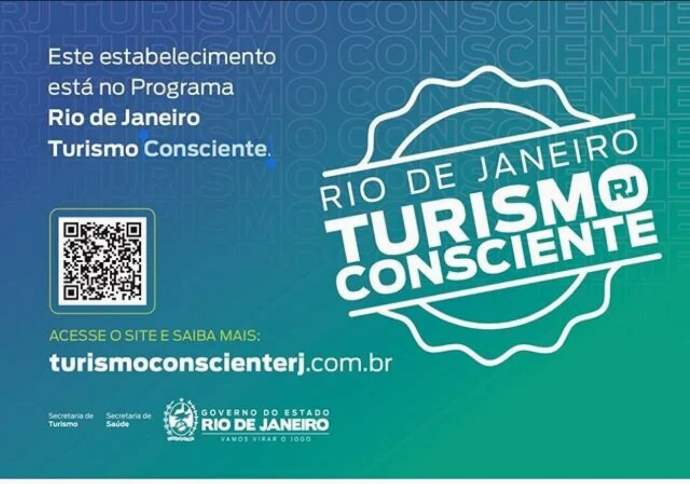
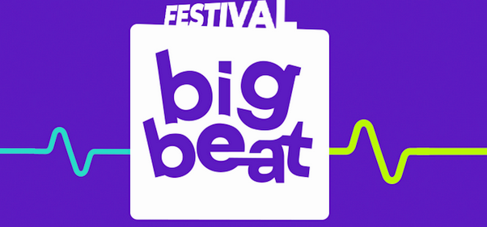
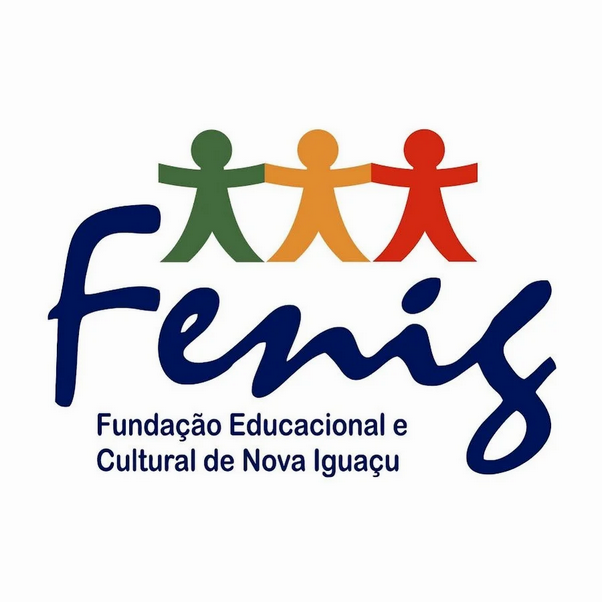


Meu nome é Claudio de Moraes: Jornalista, Produtor, Pai e Aventureiro. Foram 40 anos viajando a trabalho e férias. Descrevo aqui minhas experiências pelo planeta!


## Quem Sou Eu

Fui responsável durante 5 anos (2010 a 2015), produzindo e executando a gravação do programa PLANETA EXTREMO. Pólo Sul, Pólo Norte, Deserto do Saara, Vietnã, China, Bahamas, África(Rio Zambeze), Noruega, Utah(EUA), Nepal, Havaí (EUA), Micronésia (Truck Lagoon), Chile (Deserto do Atacama), Argentina (Andes), Vanuatu (Vulcão Ambrhim).

Esses são alguns dos países que me hospedei, trabalhei e pude presenciar momentos incíveis e de muita responsabilidade pois a única preocupação minha era trazer os meus amigos de volta pra casa, em segurança. A maior experiência foi com o terremoto do Nepal, em abril de 2015, aonde eu e minha equipe vivenciamos in locco, o sofrimento daquele povo humilde. Essa experiência foi o meu mestrado em responsabilidade  e segurança com a vida alheia. 

Durante 6 anos (2003 a 2009), produzi, transmiti e editei o Mundial de Surfe nas praias da Polinésia Francesa, Micronésia, África, Havaí, Califórnia, Japão, Austrália, Nova Zelândia, Europa, América Central, para o programa ZONA DE IMPACTO, no Sportv e para os telejornais da TV GLOBO. 

Por 10 anos trabalhando com a Seleção Brasileira. Foram 4 Copas do Mundo (Itália, EUA, França e Alemanha), e 3 Olimpíadas ( Barcelona, Atlanta e Sidney.  Atuei em 5 COPAS DAS CONFEDERAÇÕES. Uruguai, Bolivia, Arábia Saudita e México e  durante 14 anos produzi editei para o ESPORTE ESPETACULAR.  Produzi 7 Pororocas na Amazônia.  Fiz 15 expedições pelo interior do Brasil (Bonito, Chapada Diamantina, Floresta Amazônica (Amazonas, Amapá e Pará). Por 2 anos produzi séries para o FANTÁSTICO E ESPORTE ESPETACULAR no Líbano sobre o partido Hezbolah. 

Foram quase 90 países em 40 anos de profissão. Essa experiência me faz a certeza de proporcionar à você segurança e tranquilidade nas suas viagens e aventuras pelo planeta. Não sou um 0800, um robô,  e pela experiência que tenho, posso dar atendimento personalizado nas suas viagens durante as 24h do dia.

Desde a minha adolescência meu sonho era viajar na busca das ondas que alimentavam meus pensamentos através das poucas revistas especializadas que existiam nos anos 70. Meu único destino na época era sair bem cedinho com alguns amigos, do Meier, na zona norte do Rio de Janeiro, para desfrutar e surfar nas ondas das praias mais "remotas" da cidade, como Prainha, Grumari e Barra da Tijuca. Algumas delas nem tinham asfalto.

Nunca poderia imaginar que anos depois conheceria não só as praias mais lindas e sonhadas desse planeta mas estar em lugares aonde poucos brasileiros estiveram ou aonde nunca um sul americano pisou, como a caverna de Hang Song Dong, no Vietnã. Conheci aproximadamente 84 países! Vivenciei rastros de guerra e do ódio, no Líbano. Presenciei um devastador terremoto, no Nepal. Vivi por 23 dias no acampamento base da maior montanha do planeta , o Everest. Tive a honra de trabalhar em 4 Copas do Mundo e 3 Olimpíadas. Perdi a conta dos eventos pelo mundo afora que trabalhei, seja como editor de imagens, produtor, câmera ou como turista. E se o ditado diz que viajar alimenta a alma, posso afirmar que o maior legado é o conhecimento.

Por isso te convido a romper as fronteiras desse planeta sem medo de ser feliz! Você não precisa ser um poliglota para desbravar seus sonhos. A relação, o contato, ouvindo outras línguas, observando as culturas e cidadãos de outros países, são sensações e emoções que te lapidam para ser uma pessoa melhor, seja como homem, como pai. como profissional e como cidadão. Enfim, agora quero compartilhar meu conhecimento com todos, nessa rede aberta. Vem comigo! Porque a vida é curta e podemos sonhar nosso tempo! É de graça e não faz mal nenhum! Viajar é aprender a ver seu país com outros olhos. Posso te garantir que será o gasto com o melhor custo benefício do seu tempo, seja lá aonde você esteja. Não importa a distância ou os obstáculos. Viajar é como escalar uma montanha. Por que ir até o cume? Porque simplesmente existe a possibilidade de concretizar esse sonho.

Essa é a minha intenção. Levar pessoas comuns a lugares inimagináveis!

<strong>Viaje e sonhe!</strong>

## Parceiros

  
  
  
  
  
  
